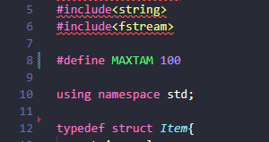
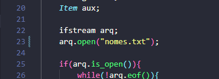

# Exercício 02: lista linear de nomes

 
 
</a> 

<h6><a>Proposta do exercício</a></h6>

 

<h6><a>Como executar</a></h6>

No arquivo há um arquivo nomes.txt nele está uma lista de 100 nomes dos quais o seu programa vai ler inserir em uma lista e trata-lós removendo os nomes repetidos.

Caso queira alterar a lista de nomes basta adicionar nomes ou retirar lembrando que o programa lê um nome por linha e está fixado em 100 nomes, mas caso queria aumentar altere o MAXTAM da imagem abaixo.

 

Se pretende mudar o arquivo texto que é lido, mude a linha 23 com o nome do novo arquivo texto que deseje.

 

# Compilação e Execução

O exercício 02 disponibilizado possui um arquivo Makefile que realiza todo o procedimento de compilação e execução. Para tanto, temos as seguintes diretrizes de execução:

| Comando                |  Função                                                                                           |                     
| -----------------------| ------------------------------------------------------------------------------------------------- |
|  `make clean`          | Apaga a última compilação realizada contida na pasta build                                        |
|  `make`                | Executa a compilação do programa utilizando o g++, e o resultado vai para a pasta build           |
|  `make run`            | Executa o programa da pasta build após a realização da compilação             

# Custo computanacional

Gerenciei os espaços em branco colocando um "\0" nos nomes repetidos e o custo computacional para novas inserções no pior caso seria de n.

# Contato

<a href="https://t.me/caio_fer_dias">
 

